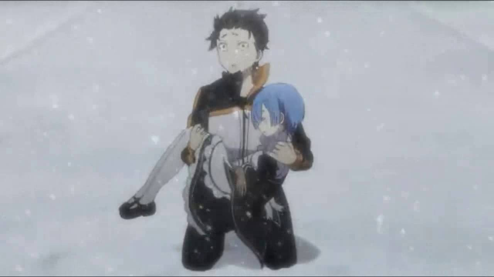

# From Zero!

When I first watched Re:Zero back in 2019, I watched the then airing english dub, which had only half finished coming out. As a concequence, I thought the end of the show was the notoriously devistating episode 15. At that time I thought I had completed it and found the decision to end the show on such a terribly bleak note rather confusing.

It's been so long now I don't even remember how I went back to it. I think the show might have came up in a discussion with a friend in 9th grade geography? Such musings are now lost to time. 

In the end, I watched the rest of the first season, and what had released of the second season, became an Emilia fanboy, and the rest was history.

It's no secret how much the story means to me. Between the anime, light novels, and manga, i've probably commited around 2 months of my life to it.

I think it's such a pertinant, deep story, that simultaniously casts a vary wide shadow when it comes to themes and the topics it addresses.  

